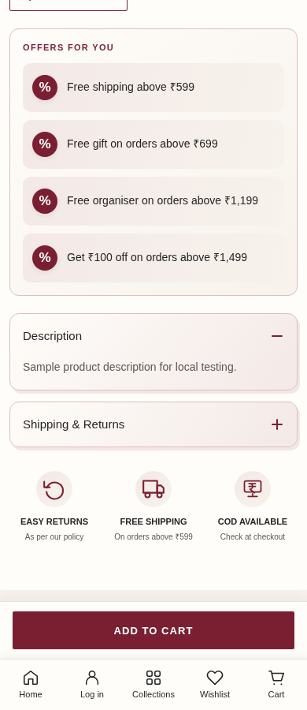

# Gujju Jewels — Mobile Navigation v8

Complete Shopify theme based on the supplied `theme_export__gujjujewels-com-gujju-jewels-slider-wishlist-v7__10OCT2026-0115pm.zip`.

## Requested changes

| Change | Result | Shopify control |
| --- | --- | --- |
| Mobile bottom bar | Home, Log in/Account, Collections, Wishlist, Cart below 990px. Ivory background and burgundy accents by default. | Customize → Footer group → Mobile bottom bar |
| Smaller hearts | Product-card circle 32px, heart 18px, transparent 44px tap area; header heart 20px below 990px. Desktop sizes preserved. | Implemented in `assets/wishlist.css` |
| Category/New Arrivals gap | 8px category bottom padding + 16px New Arrivals top padding on mobile/tablet. The existing horizontal category row is retained. | Shop Categories → Bottom spacing for swipeable row; New Arrivals → Mobile top spacing |
| Sticky product purchase button | Existing Add to Cart remains immediately above the bottom navigation instead of overlapping it. | Existing product section settings are retained |

The bottom bar has editable visibility, labels, Collections URL, account/wishlist visibility and colours. It uses the existing wishlist drawer and Shopify cart counters, including automatic quantity updates. Labels with enlarged/wrapped text are accommodated by measuring the bar's real height. Safe-area padding is included. Header, search and wishlist drawers stay above the navigation.

Collections defaults to `/collections/all`, so it displays available jewellery without relying on the currently empty collection-directory template. Select another destination under the bottom bar's settings if preferred.

## Repairs to the supplied export

The supplied ZIP contained an empty `config/settings_schema.json` (`[]`) and omitted `config/settings_data.json`, `sections/main-product.liquid` and `templates/product.json`. Those four files were restored **byte-for-byte from the earlier complete v7 package already supplied in this conversation**. This restores the theme settings and the existing product page instead of substituting a newly designed product page.

Global values missing from this export cannot reveal later changes made in Shopify. The restored global configuration uses the earlier v7 values; check favicon, fonts, colours and theme settings in Preview before publishing. The latest uploaded homepage, hero image references, header-group and footer content are retained. The only homepage data changes are category row bottom spacing and New Arrivals mobile top spacing.

Compared with the uploaded ZIP, 92 of 98 files remain byte-for-byte unchanged. Six existing files changed and six files were added (three new navigation files and three missing-file restorations). See `review/change-audit.json` for the exact list. The existing cart, quantity, product enhancement, wishlist and hero-slider JavaScript files were not changed. No payment gateway, COD app or review app was added.

## Upload and configure

1. In Shopify Admin, open Online Store → Themes → Add theme → Upload ZIP file.
2. Upload `Gujju-Jewels-Mobile-Navigation-v8.zip` directly. It contains the Shopify theme directories at the ZIP root.
3. Preview the uploaded theme on mobile and desktop. Your current published theme remains available while you review this new theme.
4. Open Customize → Footer group → Mobile bottom bar to adjust labels, colours, visibility or Collections destination.
5. Open Shopify Settings → Customer accounts and enable customer accounts for the Log in link. This is native Shopify login, with the authentication method controlled by Shopify; no phone-OTP app was installed.
6. Preview one product, change a cart quantity and open Wishlist, then publish when ready.

The wishlist continues to use browser storage. It is preserved for returning visitors in the same browser and does not synchronize between different devices or customer accounts. Wishlist/Cart badges are displayed when the count is greater than zero.

## Validation

- All JSON, section/snippet/asset references and JavaScript syntax checked.
- Shopify Theme Check: zero errors. Two existing warnings remain: 41 product-section settings exceed the check's suggested 40, and an existing unused `product-image` snippet. They were preserved to avoid removing controls or unrelated code.
- 21 local browser checks passed, including nine homepage widths: 320, 360, 390, 430, 768, 989, 990, 1440 and 1920px.
- Verified smaller hearts, 24px category-to-New-Arrivals gap below 990px, original desktop sizes/spacing, bottom-bar links, cart/wishlist counts, wishlist save/remove/focus, quick add, cart quantity autosave/removal/totals, native checkout form submission, product variant state, non-overlapping sticky bars, slider autoplay, editable bar options and editor unload cleanup.
- ZIP integrity and every packaged file verified.

Browser tests use simulated Shopify products, cart responses and accounts. No real orders, payments, login sessions or live-store changes were made. Previews use bundled sample photographs; the theme package preserves the supplied merchant image references.

## Local layout previews

